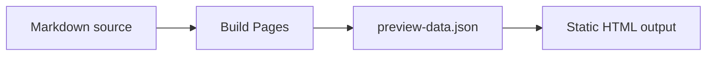

# Markdown Examples

This page is a rendering fixture for `zeropress.docs1`. Use it to check typography, spacing, code highlighting, tables, task lists, alerts, and Mermaid progressive enhancement.

## Paragraphs, Emphasis, And Links

Markdown paragraphs should read like normal document prose. Inline emphasis such as **strong text**, _emphasized text_, ~~struck text~~, and `inline code` should remain easy to scan inside a sentence.

Internal Markdown links are source-relative. For example, [the configuration page](../guides/configuration.md) links to another source Markdown file and is rewritten during build.

This page itself is written as `markdown-examples/index.md`, so it is published as a directory-style page at `/markdown-examples/`.

## Heading Hierarchy

Headings become anchorable sections. Docs1 renders a page table of contents when the Markdown page has enough headings.

### Third-Level Heading

Third-level headings should appear subordinate to section headings but remain visible enough for long pages.

#### Fourth-Level Heading

Fourth-level headings are useful for compact implementation details.

## Lists

Unordered lists are useful for short related facts:

- Markdown files are discovered from the source directory.
- The page route is derived from the source path unless front matter overrides it.
- Public files are copied from the public directory.

Ordered lists are useful for procedures:

1. Create Markdown files.
2. Add optional `.zeropress/config.json`.
3. Run Build Pages.
4. Deploy the generated output.

Task lists are supported:

- [x] Render GitHub-style task lists
- [x] Keep checked items visible
- [ ] Review the generated output
- [ ] Deploy to a static host

## GitHub-Style Alerts

> [!NOTE]
> Use alerts for short, high-signal notes.

> [!TIP]
> Keep small docs front-matter-light when the default route and title behavior already matches the document.

> [!IMPORTANT]
> `status: draft` means the Markdown file is not generated as a page.

> [!WARNING]
> `discoverability: delist` is not access control. The page still exists at its URL.

> [!CAUTION]
> Do not put private content in a static site just because it is omitted from menus or search.

## Tables

Tables are useful for compact comparisons.

| Feature | Source | Output |
| --- | --- | --- |
| Page title | Front matter or first H1 | `page.title` |
| Description | Front matter `description` | `page.excerpt` |
| Route | Source path or front matter `path` | HTML route |
| Source copy | `copy-markdown-source` | Public `.md` link |

Alignment markers are preserved as table cell classes.

| Left | Center | Right |
| :--- | :---: | ---: |
| route | page title | 1 |
| public file | copied asset | 24 |
| generated HTML | output route | 128 |

## Fenced Code Blocks

Fenced code blocks keep language classes. When the language is recognized by ZeroPress's Markdown renderer, syntax highlighting is applied during build.

```json
{
  "version": "0.1",
  "site": {
    "title": "My Docs",
    "description": "Documentation built with ZeroPress."
  }
}
```

```js
export async function build() {
  const result = await runBuildPages({
    source: "./documents",
    destination: "./_site"
  });

  return result.files;
}
```

Unknown or plain text fences still render as code blocks.

```txt
documents/
  index.md
  markdown-examples/
    index.md
```

## Mermaid Fence

Mermaid fences remain readable source without JavaScript. Docs1 progressively enhances them into diagrams when JavaScript is available.



## Escaping And Raw Text

Use code spans for literal template syntax: `{{site.title}}`, `{{page.title}}`, and `{{#if page.updated_at_iso}}`.

```html
{{#if page.collection_cursor.next}}
  <a href="{{page.collection_cursor.next.url}}">
    {{page.collection_cursor.next.title}}
  </a>
{{/if}}
```

## YouTube video

ZeroPress allows a safe subset of raw HTML inside Markdown, so you can embed a YouTube video directly:

<iframe width="560" height="315" src="https://www.youtube-nocookie.com/embed/UYmvFzDuO5k" title="YouTube video player" frameborder="0" allow="accelerometer; autoplay; clipboard-write; encrypted-media; gyroscope; picture-in-picture; web-share" referrerpolicy="strict-origin-when-cross-origin" allowfullscreen></iframe>

## Native Media

Raw HTML media elements can embed site-owned video and audio files. The source-relative public paths below are rewritten to `/media/...` during the Build Pages prebuild.

<video controls muted playsinline poster="../../public/media/video-poster.jpg" width="640">
  <source src="../../public/media/video.mp4" type="video/mp4">
  <track src="../../public/media/captions-en.vtt" kind="captions" srclang="en" label="English" default>
</video>

<audio controls preload="metadata">
  <source src="../../public/media/audio.mp3" type="audio/mpeg">
</audio>

## Compact Review Checklist

- Headings have clear hierarchy and enough spacing.
- Tables are readable on narrow screens.
- Code blocks scroll horizontally without moving the copy button.
- Alerts are visually distinct but not louder than page headings.
- The page remains useful when JavaScript is disabled.
